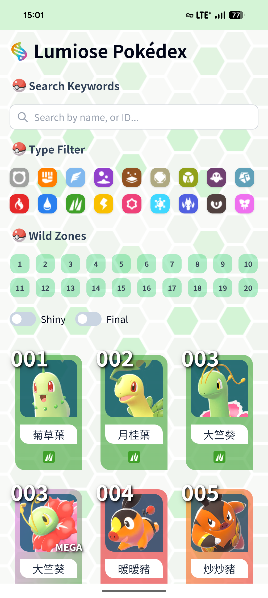
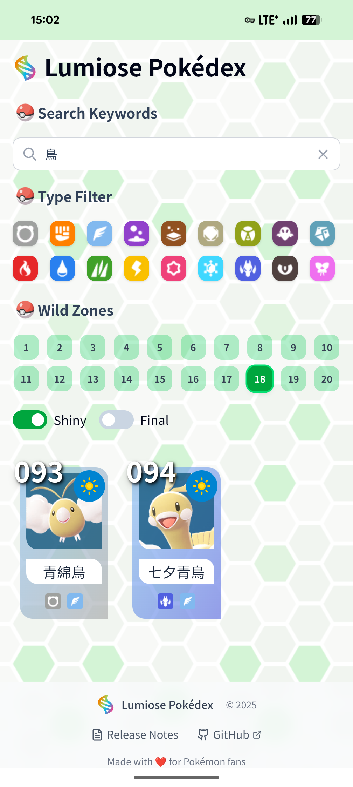
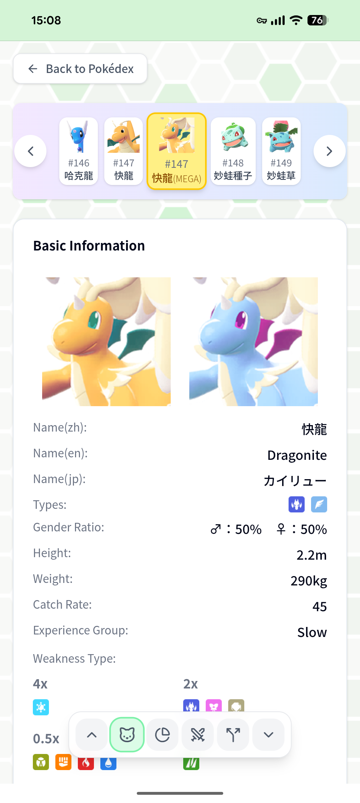
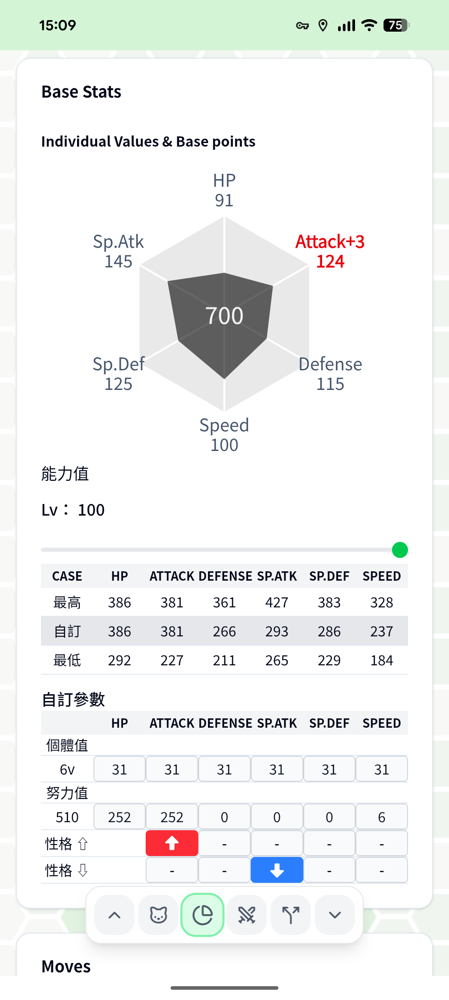
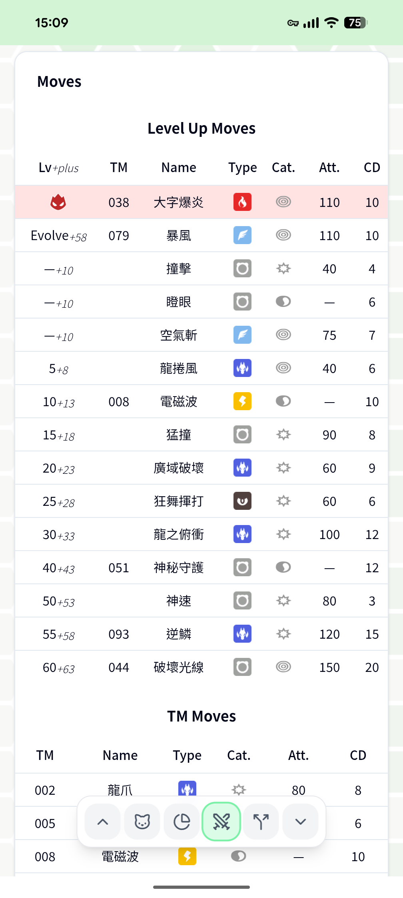
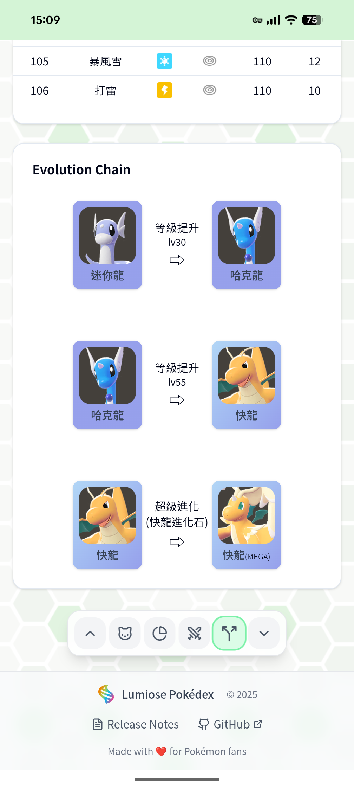

# Lumiose Pokédex

A modern, responsive Pokédex web application built with React, TypeScript, and Vite, featuring comprehensive Pokémon data from Pokémon Legends: Z-A with multi-language support.

## 🏗️ Architecture Overview

### Tech Stack

- **Frontend Framework**: React 19.1.1 with TypeScript
- **Build Tool**: Vite 7.1.7
- **Routing**: React Router DOM 7.9.5
- **Styling**: Tailwind CSS 4.1.16
- **UI Components**: Radix UI primitives
- **Icons**: Lucide React
- **State Management**: React Context API
- **PWA Support**: Service Worker with offline capabilities

### Project Structure

```
src/
├── components/           # Reusable UI components
│   ├── pokemon/         # Pokemon-specific components
│   ├── ui/              # Generic UI components
│   └── icon/            # Icon components
├── contexts/            # React Context providers
│   └── PokemonContext.tsx
├── hooks/               # Custom React hooks
│   ├── usePokemonData.ts
│   ├── usePokemonFilter.ts
│   ├── useShinyToggle.ts
│   └── useUrlParams.ts
├── layouts/             # Layout components
│   └── MainLayout.tsx
├── lib/                 # Utility libraries
│   ├── constants/       # Application constants
│   └── utils/           # Helper functions
├── pages/               # Page components
│   ├── home/            # Home page with Pokemon grid
│   └── pokemon/         # Pokemon detail pages
├── services/            # API services
│   └── pokemonService.ts
├── types/               # TypeScript type definitions
│   └── pokemon.ts
└── utils/               # Utility functions
```

### Data Architecture

#### Data Sources

- **Static JSON Files**: Pre-processed Pokemon data stored in `public/data/`
- **Base Pokemon List**: `base_pm_list_101.json` contains all Pokemon with basic info
- **Detailed Pokemon Data**: Individual JSON files in `public/data/pm/` for detailed information
- **Multi-language Support**: Data includes Chinese (zh), Japanese (ja), and English (en) names

#### Data Processing Pipeline

The `scripts/` directory contains ETL (Extract, Transform, Load) processes:

- **ETL.js**: Main data processing pipeline
- **pokemonDataParser.js**: Parses raw Pokemon data files
- **mergeData.js**: Merges multi-language data sources
- **convertSpecies.js**: Converts species names across languages
- **convertMoves.js**: Processes move data with multi-language support
- **convertAbilities.js**: Handles ability name conversions
- **copyPokemonIcons.js**: Manages Pokemon icon assets

### Component Architecture

#### State Management

- **PokemonContext**: Global state management for Pokemon data
- **Custom Hooks**: Encapsulate specific functionality
  - `usePokemonData`: Manages Pokemon data fetching and loading states
  - `usePokemonFilter`: Handles filtering logic (type, search, zone, final form)
  - `useShinyToggle`: Manages shiny Pokemon display toggle
  - `useUrlParams`: Synchronizes filter state with URL parameters

#### Key Components

**Home Page (`src/pages/home/`)**

- Pokemon grid display with responsive layout
- Advanced filtering system:
  - Search by name or ID
  - Type-based filtering (supports multiple types)
  - Zone-based filtering
  - Final evolution form toggle
  - Shiny/normal sprite toggle
- Real-time filtering with URL parameter synchronization

**Pokemon Detail Page (`src/pages/pokemon/`)**

- Comprehensive Pokemon information display
- Navigation between Pokemon
- Sections include:
  - Basic information (stats, types, abilities)
  - Move sets (level-up moves, TM moves)
  - Evolution tree with interactive navigation
  - Type effectiveness chart

#### Filtering System

The application features a sophisticated filtering system:

```typescript
// Multi-criteria filtering with performance optimization
const filteredPokemonList = useMemo(() => {
  let result = pokemonList;

  // Final form filter
  if (isFinalFormOnly) {
    result = getFinalFormPokemon(result);
  }

  // Keyword search (name, altForm, lumioseId)
  if (searchKeyword.trim()) {
    result = result.filter((pokemon) => keywordMatches(pokemon, searchKeyword));
  }

  // Type filtering (supports multiple types)
  if (selectedTypes.length > 0) {
    result = result.filter((pokemon) => typeMatches(pokemon.type, selectedTypes));
  }

  // Zone filtering
  if (selectedZone.trim()) {
    result = result.filter((pokemon) => zoneMatches(pokemon, selectedZone));
  }

  return result;
}, [pokemonList, selectedTypes, searchKeyword, selectedZone, isFinalFormOnly]);
```

### Performance Optimizations

- **Memoization**: Extensive use of `useMemo` and `useCallback` for expensive operations
- **Component Memoization**: `memo()` wrapper for Pokemon grid to prevent unnecessary re-renders
- **Lazy Loading**: Pokemon detail data loaded on-demand
- **URL State Synchronization**: Filter states persist across page refreshes
- **Optimized Filtering**: Efficient algorithms for multi-criteria filtering

### PWA Features

- **Service Worker**: Offline functionality and caching
- **Manifest**: App installation support
- **Responsive Design**: Mobile-first approach with adaptive layouts
- **Performance**: Optimized loading and rendering

### Analytics Integration

- **Google Analytics**: Page view and custom event tracking
- **Custom Events**: Pokemon detail views, navigation patterns, filter usage
- **Performance Monitoring**: User interaction tracking

### Development Workflow

#### Build Process

```bash
npm run dev      # Development server with HMR
npm run build    # Production build with TypeScript compilation
npm run preview  # Preview production build
npm run lint     # ESLint code quality checks
```

#### Data Processing

```bash
cd scripts
./run.sh         # Execute complete ETL pipeline
```

### Type Safety

Comprehensive TypeScript definitions ensure type safety across the application:

```typescript
interface Pokemon {
  pid: number;
  lumioseId: number;
  link: string;
  name: PokemonName;
  base: [number, number, number, number, number, number];
  ev: [number, number, number, number, number, number];
  type: string[];
  source: string;
  latest: boolean;
  altForm?: string;
  zone?: Zone[];
}
```

## 🚀 Getting Started

### Prerequisites

- Node.js (version specified in `.nvmrc`)
- npm or yarn package manager

### Installation

```bash
# Clone the repository
git clone <repository-url>
cd lumiose

# Install dependencies
npm install

# Start development server
npm run dev
```

### Building for Production

```bash
# Build the application
npm run build

# Preview the production build
npm run preview
```

## 📱 Features

### Home Page - Pokemon Grid & Filtering

|                                                                                                           Home Page Overview                                                                                                           |                                                                                                     Advanced Filtering                                                                                                     |
| :------------------------------------------------------------------------------------------------------------------------------------------------------------------------------------------------------------------------------------: | :------------------------------------------------------------------------------------------------------------------------------------------------------------------------------------------------------------------------: |
|                                                                                                                                                                                                   |                                                                                                                                                                                       |
| **Main Interface Features:**<br/>• Search by name, ID, or alternative forms<br/>• Multi-select type filtering with visual badges<br/>• Zone-based Pokemon filtering<br/>• Shiny/normal sprite toggle<br/>• Final evolution form toggle | **Advanced Filtering Capabilities:**<br/>• Multi-type selection combinations<br/>• Real-time filtering with smooth animations<br/>• URL state persistence for shareable views<br/>• Responsive grid layout for all devices |

### Pokemon Detail Pages

|                                                                           Basic Information & Stats                                                                            |                                                                                           IV/EV Calculator & Stats                                                                                            |
| :----------------------------------------------------------------------------------------------------------------------------------------------------------------------------: | :-----------------------------------------------------------------------------------------------------------------------------------------------------------------------------------------------------------: |
|                                                                                                                                 |                                                                                                                                                                 |
| **Comprehensive Pokemon Data:**<br/>• Multi-language names<br/>• Interactive base stats visualization<br/>• Type information with effectiveness<br/>• Physical characteristics | **Advanced Stats Calculator:**<br/>• Individual Values (IV) calculator and display<br/>• Effort Values (EV) tracking and optimization<br/>• Real-time stat calculations<br/>• Competitive battle optimization |

|                                                                                                        Moves & Abilities                                                                                                        |                                                                                                            Evolution Tree                                                                                                             |
| :-----------------------------------------------------------------------------------------------------------------------------------------------------------------------------------------------------------------------------: | :-----------------------------------------------------------------------------------------------------------------------------------------------------------------------------------------------------------------------------------: |
|                                                                                                                                                                                  |                                                                                                                                                                                           |
| **Detailed Move Information:**<br/>• Level-up moves with power and cooldown data<br/>• TM compatibility with move categories<br/>• Alpha moves with special descriptions<br/>• Move classifications (Physical, Special, Status) | **Interactive Evolution System:**<br/>• Visual evolution chain representation<br/>• Level requirements and special conditions<br/>• Click-to-navigate between evolution forms<br/>• Support for regional variants and mega evolutions |

### Core Features

- **Comprehensive Pokemon Database**: Complete Pokemon data with multi-language support
- **Advanced Search & Filtering**: Search by name, ID, type, zone, and evolution status
- **Interactive Pokemon Details**: Detailed stats, moves, abilities, and evolution trees
- **Responsive Design**: Optimized for desktop, tablet, and mobile devices
- **PWA Support**: Install as a native app with offline functionality
- **Shiny Pokemon Toggle**: Switch between normal and shiny sprites
- **Multi-language Support**: Chinese, Japanese, and English names
- **Real-time Filtering**: Instant results with URL state persistence
- **Evolution Navigation**: Interactive evolution tree with direct navigation
- **Type Effectiveness**: Visual type matchup charts
- **Performance Optimized**: Fast loading and smooth interactions

### Technical Features

- **Offline Support**: Service worker for offline functionality
- **URL State Management**: Shareable filtered views
- **Analytics Integration**: User behavior tracking
- **Accessibility**: ARIA labels and keyboard navigation
- **SEO Optimized**: Meta tags and structured data
- **Cross-browser Compatibility**: Modern browser support
